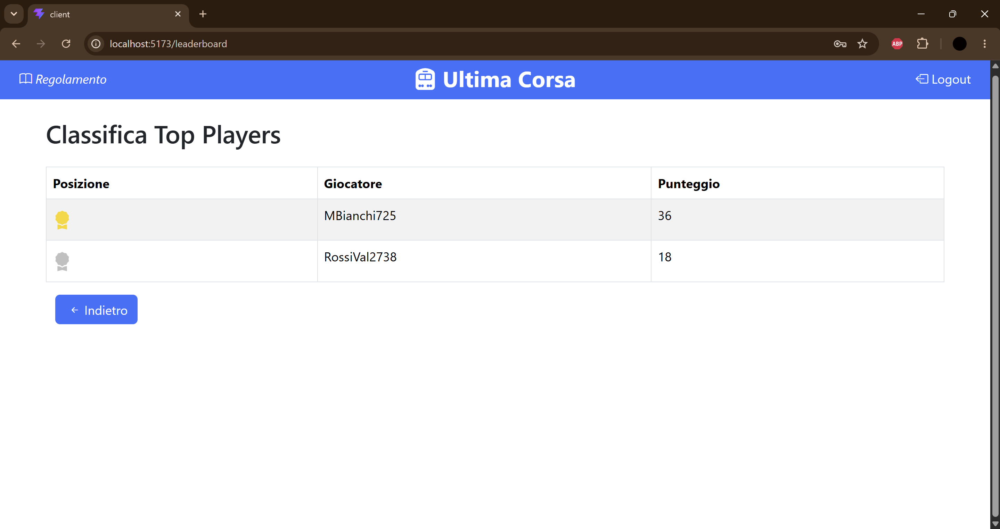
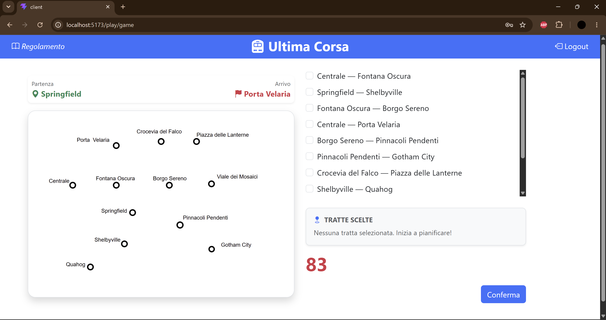

# Game: "Ultima corsa"
Full-stack web application developed with React, Node.js, Express and SQLite.

> University project — Politecnico di Torino

## React Client Application Routes

- Route `/`: page with login form
- Route `/play/game`: page where the game starts and finishes, game phases are managed with states
- Route `/leaderboard`: page where general leaderboard can be seen

## API Server

- POST `/api/sessions`-> Create a new session (performs log in)
  - request parameters and request body content:
    A json object containing user's email and password
    ```
    {
    "email": "mariobianchi@gmail.com",
    "password": "banana"
    }
    ```
  - Response: `201 Created` (success) or `401 Unauthorized` (failure, invalid credentials) or `500 Internal Server Error` (failure).

  - response body content: 
    A json object with the user's information
    ```
    {
      "userID": 1,
      "username": "MarioB",
      "email": "mariobianchi@gmail.com",
      "pointsMax": 0
    }
    ```


- GET `/api/sessions/current` -> check if the user is still logged in

  Response: `200 OK` (success) or `401 Unauthorized` (failure, not authenticated) or `500 Internal Server Error` (failure).

  - response body content
  ```
    {
      "userID": 1,
      "username": "MarioB",
      "email": "mariobianchi@gmail.com",
      "pointsMax": 0
    }
  ```


- DELETE `/api/sessions/current`-> Delete the session for the current user (perform the logout).
  - Response: `204 No Content`(success) or `401 Unauthorized` (failure, not authenticated) or `500 Internal Server Error` (failure).


- GET `/api/trainmap` -> Gets the whole underground map
  - Response: `200 OK` (success) or `401 Unauthorized` (failure, not authenticated) or `500 Internal Server Error` (failure)

  - response body content
 [
  {
    "station1Name": "Centrale",
    "station2Name": "Loreto",
    "lineColour": "Verde"
  },
  {
    "station1Name": "Loreto",
    "station2Name": "Piola",
    "lineColour": "Verde"
  },
  ...
]


- GET `/api/leaderboard` -> Gets the leaderboard
  - Response: `200 OK` (success) or `401 Unauthorized` (failure, not authenticated) or `500 Internal Server Error` (failure)
  - response body content
  ```
  [
    {
      "username": "MarioB",
      "pointsMax": 29
    },
    {
      ...
    },
    ...
  ]
  ```  

- POST `/api/games/start` -> creates the initial condition to start the game (adds it in the server-side session to avoid cheating)
  - Response: `201 Created` (success) or `401 Unauthorized` (failure, not authenticated) or `500 Internal Server Error` (failure)
  - response body content
  {
  "startStationName": "Centrale",
  "arriveStationName": "Gotham City"
  }


- POST `/api/games/result` -> Checks if the route chosen by the user is valid and gives the results of the game
  - request parameters and request body content:
  [
  {
    "station1Name": "Centrale",
    "station2Name": "Loreto",
    "lineColour": "Verde"
  },
  {
    "station1Name": "Loreto",
    "station2Name": "Piola",
    "lineColour": "Verde"
  },
  ...
  ]
  - Response: `200 OK` (success) or `401 Unauthorized` (failure, not authenticated) or `422 Unprocessable Entity` (failure, invalid data) or `409 Conflict` (failure, no game started) or `500 Internal Server Error` (failure)
  - response body content (valid trip)
  ```
    {
    "isValid": true,
    "finalPoints": 35,
    "eventsFound": [
      { "eventID":1, "eventDescription": "Senza biglietto", "points": -3 },
      { "eventID":2, "eventDescription": "Treno perfettamente in orario", "points": +2 }
    ]
    }
  ``` 

  - response body content (invalid trip)
  ```
  {
    "isValid" : false,
    "finalPoints" : 0,
    "eventsFound" : []
  }
  ```


## Database Tables

- Table `users` - contains userID, username, email, hashedPassword, salt, pointsMax
- Table `stations` - contains stationID, stationName
- Table `lines` - contains lineID, lineColour
- Table `routes` - contains station1ID, station2ID, lineID
- Table `events` - contains eventID, eventDescription, points

## Main React Components

- `LoginForm` (in `AuthComponents.jsx`): manages user's login; email and password must be inserted
- `LogoutButton` (in `AuthComponents.jsx`): manages user's logout
- `NavHeader` (in `NavHeader.jsx`): program's navbar, contains rules button and logout button
- `GameComponent` (in `GameComponent.jsx`): manages the whole execution of the game, dividing it into each phase
- `Leaderboard` (in `Leaderboard.jsx`): shows the users that acquired the biggest amount of points

(only _main_ components, minor ones may be skipped)

## Screenshot





## Demo accounts

- *email*: mariobianchi@gmail.com, *password*: banana
- *email*: valentinorossi@gmail.com, *password*: mela 
- *email*: giovanniverdi@gmail.com, *password*: anguria

## Use of AI Tools
Claude AI was briefly used to modify the frontend layout, to choose the right tags and make the game look nicer. 
In the backend it was used to check the code syntax.
Copilot was used to give a brief final coherency check.

## Tech Stack

### Frontend
- React
- React Router
- Bootstrap

### Backend
- Node.js
- Express
- Passport.js
- REST APIs
- Cors
- Morgan

### Database
- SQLite

### Development
- Vite
- ESLint

## Features

- User authentication
- Game session management
- Score tracking
- Leaderboard
- Persistent data storage with SQLite
- Responsive web interface


## How to Run

### Backend

```bash
cd server
npm install
nodemon index.js
```
### Frontend

```bash
cd client
npm install
npm run dev
```

